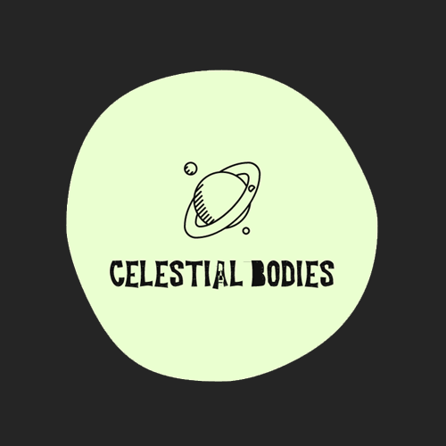

<p align="center">
  
</p>

<p align="center">
  <a href="#">
    
  </a>
  <a href="#">
    
  </a>
  <a href="#">
    
  </a>
  <a href="#">
    
  </a>
  <a href="#">
    
  </a>
  <br>
</p>

<p align="center">:rocket: Lightweight wrapper for NASA's API library.</p>


## Introduction
Celestial Bodies is a lightweight wrapper for NASA's API library. 

## Table of Contents

<a href="#system-requirements" style="font-weight: bold !imporant; color: #171A5B !imporant;">System Requirements</a>

- [Installation](#installation)
- [Usage](#usage)
- [Roles & Permissions](#roles--permissions)
- [Features](#features)
- [Updates](#updates)
- [Contributing](#contributing)
- [License](#license)
- [Credits](#credits)

## System Requirements


At its core, Celestial Bodies relies on Node.js and NPM for its core functionality. 

- Node.js ~14.15.1
- NPM ~6.14.8

## Installation

```
npm install celestial-bodies
```

## Usage
Require the package to access the preconfigured API functions.
```
const celestial = require('celestial-bodies');
```

##### APOD
The APOD function is used to leverage the Astronomy Picture of the Day API. 
The payload object is configurable, but only the API Key parameter is required. You can include personal API key or leave as DEMO_KEY and it will still work.
If not specified, date defaults to *today* and hd defaults to false. 

```js
const payload = {
  key: 'DEMO_KEY',
  date: '',
  hd: ''
};

celestial.apod(payload, response => {
  console.log(response);
});
```


## Features

In development

## Updates

In development

## Contributing

In development

## Credits

In development

<a href="https://www.buymeacoffee.com/hieronymousbean" target="_blank">
    
</a>

Please :star: the project if you enjoy it - much appreciated!